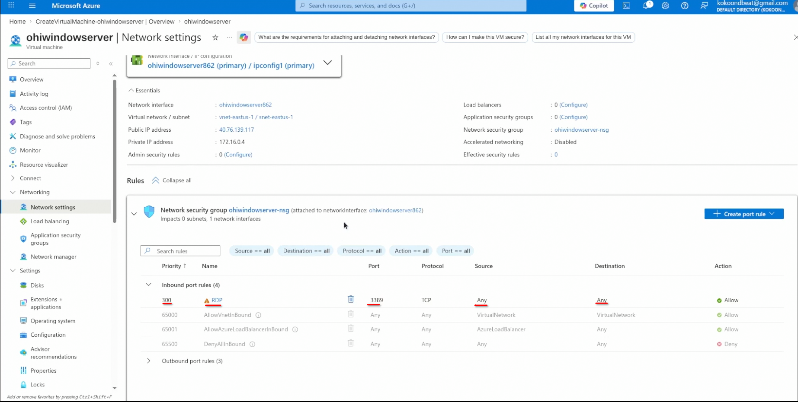
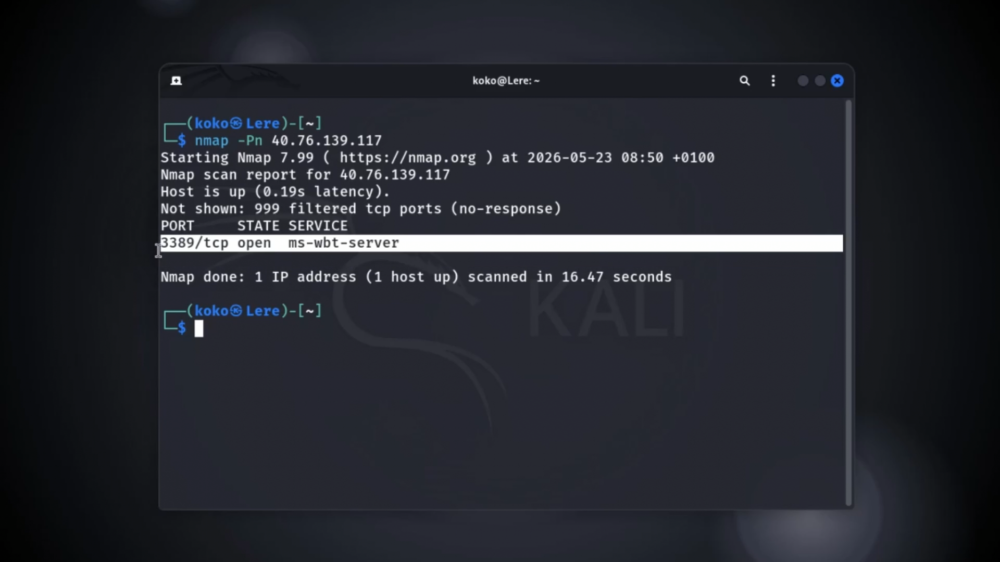
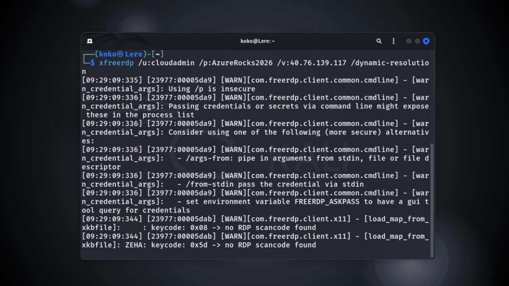
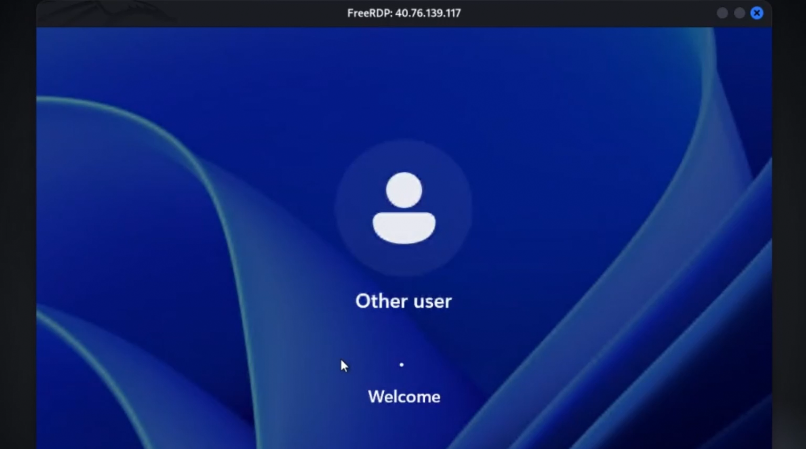
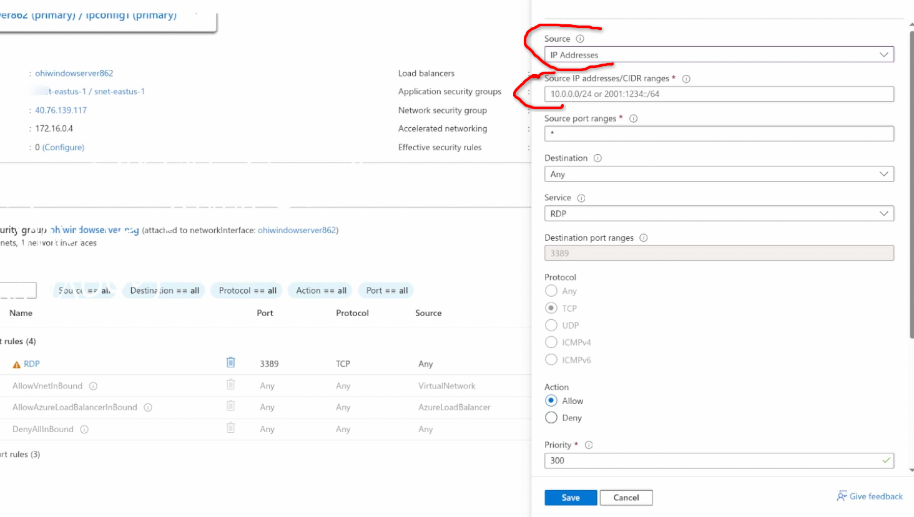
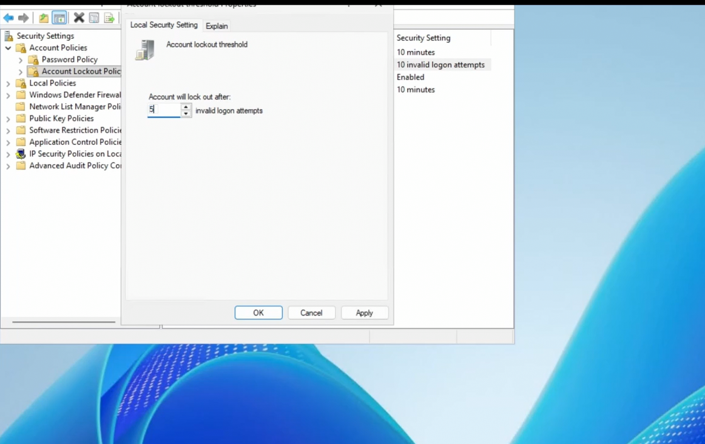
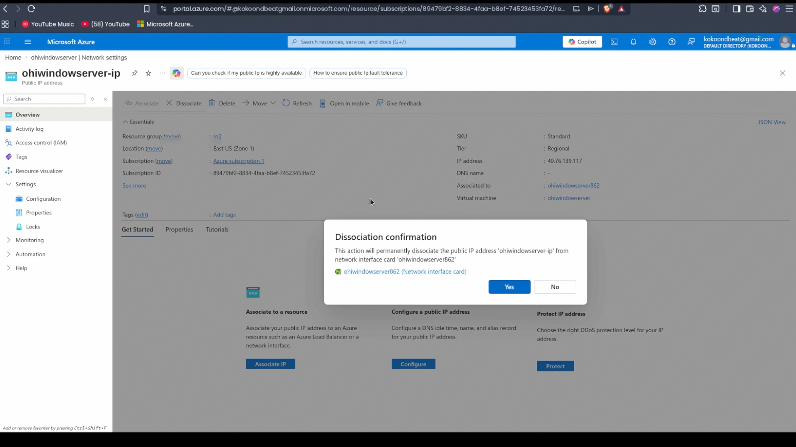
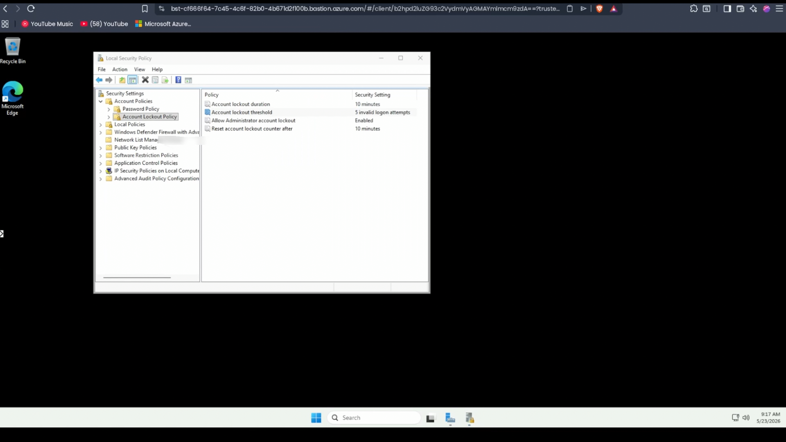

# The Open Window — Azure RDP Exposure & Defense Lab

[](https://www.youtube.com/@OhiSecure)
[](https://azure.microsoft.com/)
[](https://www.microsoft.com/)

## 📝 Executive Summary
In modern cloud architecture, perimeter security is paramount. A common misconfiguration committed by administrators and developers is exposing management ports—specifically **Remote Desktop Protocol (RDP) on Port 3389**—directly to the public internet (`0.0.0.0/0`) for convenience. 

This project serves as a practical, end-to-end security demonstration utilizing the **OhiSecure Framework** (The Victim, The Attack, The Breach, and The Defense)[cite: 1]. It demonstrates how an exposed asset is discovered via automated public scanning, simulates an active breach, and engineers a zero-trust remediation strategy using **Azure Bastion**[cite: 1].

---

## 🎯 Architectural Overview & Framework

### 🛠️ The Tech Stack
*   **Cloud Platform:** Microsoft Azure
*   **Victim OS:** Windows Server 2022 Datacenter: Azure Edition
*   **Attacker OS:** Kali Linux Rolling Edition
*   **Tooling Used:** Nmap (Reconnaissance), `xfreerdp` (Remote access), Security Policy.

---

## 🏢 Phase 1: The Victim Setup
An intentionally weak asset was provisioned inside the Azure Portal to simulate real-world vulnerable corporate infrastructure.

*   **Instance Size:** Standard B2s (2 vCPUs, 4 GiB memory)
*   **Admin Username:** `cloudadmin`
*   **Inbound Security Rules:** Port 3389 was opened to source `Any` (`0.0.0.0/0`) within the Network Security Group (NSG), mimicking a classic corporate misconfiguration.

> 




---

## 🕵️‍♂️ Phase 2: The Attack & Detection

### 1. Reconnaissance
Using an attacker machine on an external network, a targeted port sweep was conducted against the host’s public IP to confirm exposure.

```bash
nmap -p 3389 [Your-VM-Public-IP]
```
The scan returned 3389/tcp open ms-wbt-server, signaling a live Windows target to the public space.


## 🔓 Phase 3: The Breach
Using the discovered open pathway and a successful credential harvest from a standard dictionary attack, an interactive remote desktop connection was established natively via a Linux CLI utility:
``` bash
xfreerdp /u:cloudadmin /p:AzureRocks2026! /v:[Your-VM-Public-IP] /dynamic-resolution
```




## 🛡️ Phase 4: The Defense (Remediation Strategy)
To fix this vulnerability securely, three progressive levels of hardening were analyzed:

**Level 1**: Network Security Group Hardening (Good)
Restricted the inbound NSG source property strictly to the authorized administrator's static home IP address, dropping all unauthenticated external probe traffic instantly.


**Level 2**: OS-Level Account Lockout Policies (Better)
Configured the local system security parameters (secpol.msc) to enforce account locking mechanisms.

* **Path**: `Account Policies` > `Account Lockout Policy`

* **Action**: Enforced an Account lockout threshold of 5 invalid logon attempts. This neutralizes broad dictionary attacks by blocking automated password guessing sequences after 5 failed tries.


**Level 3** : The Zero-Trust Solution — Azure Bastion (Best)
The ultimate architecture removes public IP exposure completely from the server node.

* Deconfigured Public IP: The public IP was dissociated from the the virtual machine
* Provisioned Azure Bastion: Deployed a fully managed PaaS broker. RDP/SSH sessions are now proxied smoothly over Port 443 (HTTPS) directly through the Azure Portal UI.




## 🏁 Key Architectural Takeaway
Securing cloud assets requires eliminating unnecessary attack surfaces entirely. While standard password complexity policies are necessary, masking management ports through proxy patterns like Azure Bastion turns an exposed cloud vulnerability into an enterprise-grade hardened perimeter.


_Developed by **Ohilere Imiere Darlington** as part of the [OhiSecure](https://www.youtube.com/@OhiSecure) Cloud Security Series._
