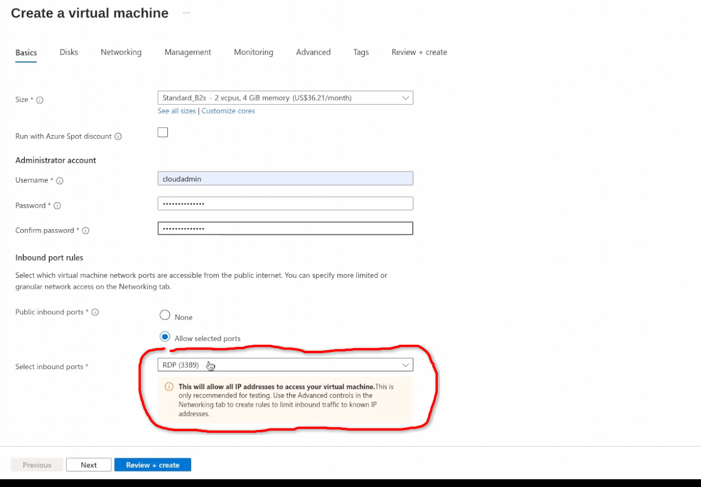

# The-Open-Window---Stop-Azure-RDP-Brute-Force-Attacks-
How a common cloud misconfiguration—leaving RDP port 3389 exposed to the internet can invite automated brute-force attacks. A step-by-step walkthrough how hackers scan for open virtual machines, make their way in, and how to shut down the threat permanently using enterprise-grade defense via azure bastion. 

